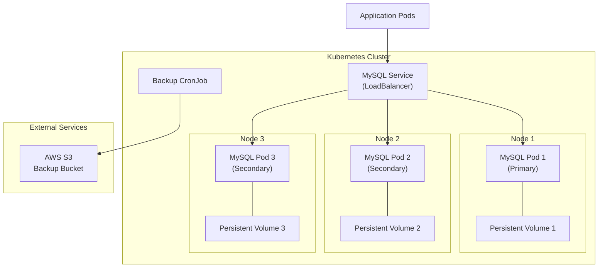
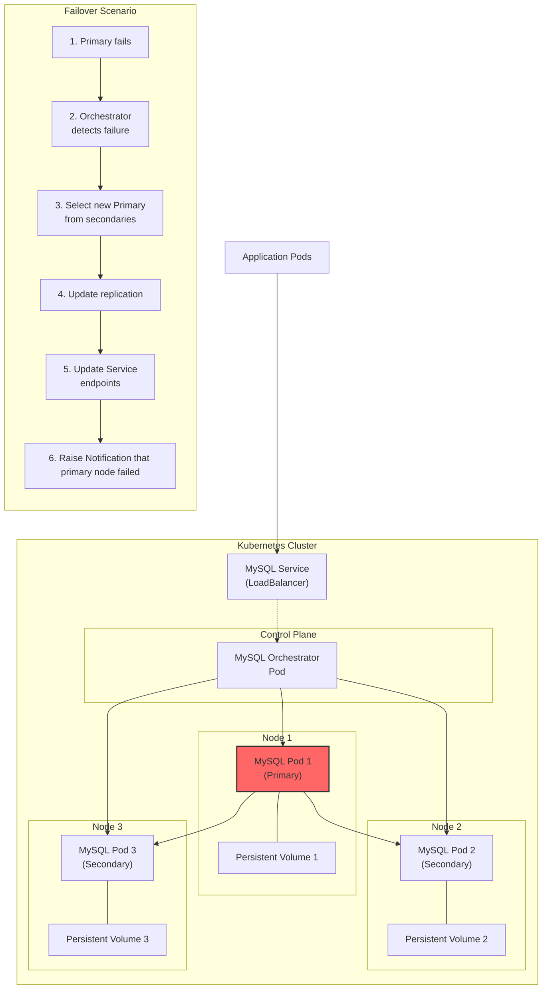

# heirloom-project
Implement the Systems and Reliability Engineer - Technical Exercise

# How to deploy

Assumes a k8s cluster already exists.
Install the helm dependancies:

    1.  install helm (brew instal helm)
    2.  helm repo add bitnami https://charts.bitnami.com/bitnami
    3.  helm repo update

Swap the credentials in values.yaml for something secure.

Deploy the helm chart to your cluster
`helm install mysql bitnami/mysql -f values.yaml`

## Diagram for High Availability MySQL Server

## Diagram for Single Node Failover Scenario
