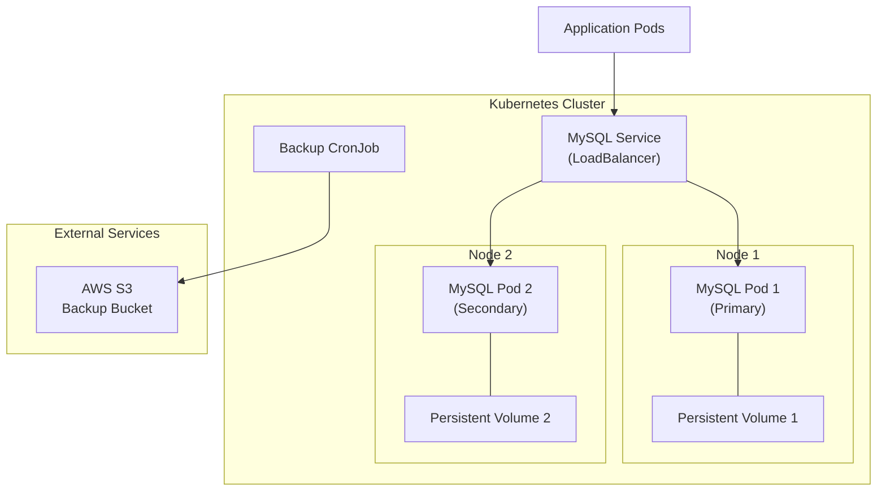
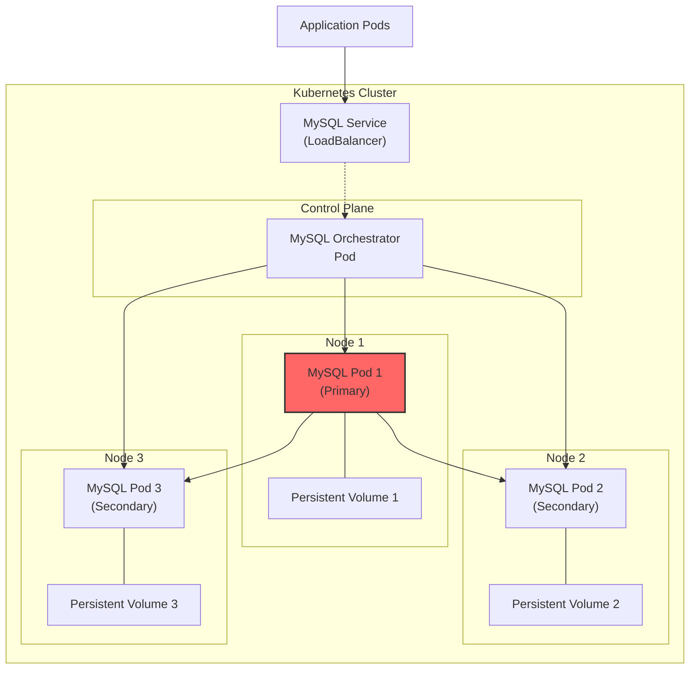

# heirloom-project
Implement the Systems and Reliability Engineer - Technical Exercise

## How to deploy k3 Cluster

This deploys a series of VMs to your local machine using multipass and then adds them to a k3s cluster.

`pip install -r requirements.txt`

`python deploy_script --workers 3`


## How to deploy Helm Chart

Assumes a cluster already exists.
Install the helm dependencies:

    1.  install helm (brew instal helm)
    2.  helm repo add bitnami https://charts.bitnami.com/bitnami
    3.  helm repo update

Swap the credentials in values.yaml for something secure.

Deploy the helm chart to your cluster
`helm install mysql bitnami/mysql -f values.yaml`

## How to test the database
To make testing easier we can forward the mysql to our localhost.

```shell
kubectl port-forward svc/mysql-primary 3306:3306
```

Now use the included test_db.py script to test reading and writing to the db.
```shell
python3 test_db.py --host localhost --password your-root-password
```

To test the self-healing and fault tolerance, delete the primary pod:
```shell
kubectl delete pod mysql-primary-0
```

The system will bring the pod back up and deploy it. You'll need to re-forward the port if you ran 
script locally (running on a client pod in the cluster avoids this). 
Once the port is forwarded, you'll see the script reading and writing without issue.
You can monitor the pods by using: `kubectl get pods -o wide -w`

## How to take a manual backup 
For the backup and restore to work correctly you'll need to swap the AWS_ACCESS_KEY_ID and AWS_SECRET_ACCESS_KEY 
in the values.yaml and the restore-job.yaml. You'll need to redeploy the helm using:
`helm upgrade mysql bitnami/mysql -f values.yaml`

The backup runs on a cron job at midnight UTC, but it can also be triggered manually. 
To trigger run the following:
```shell
kubectl create job --from=cronjob/mysql-backup-manual manual-backup-$(date +%s)
```
Technically this manual backup is also a cron, but it is scheduled to never run.

### How to Restore from Backup

To restore from backup, modify the restore-job.yaml with the BACKUP_FILE you want to restore, then apply the job.

```shell
kubectl apply -f restore-job.yaml
```

## How to Clean Up
1. First stop any existing reads / writes to the database
2. Take down the helm deployment: 
`helm uninstall mysql`
3. Then clear any persistent volume claims: `kubectl delete pvc -l app.kubernetes.io/name=mysql`
4. Finally clean up the VMs `python deploy_script --cleanup`


## Diagram for High Availability MySQL Server


## Diagram for Single Node Fail over Scenario

### Fail over Scenario

1. Primary fails
2. Orchestrator detects failure
3. Select new Primary from secondaries
4. Update replication
5. Update Service endpoints


